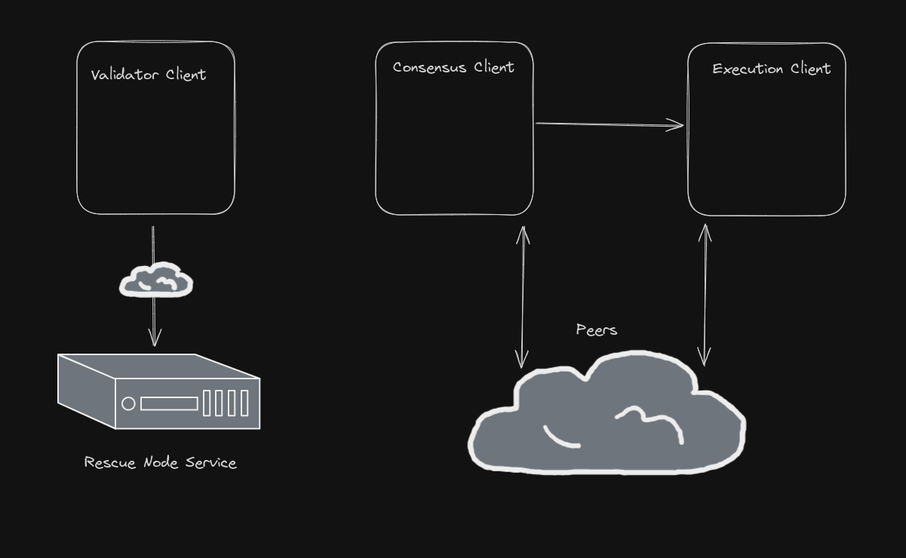

Normally, you run three clients. A Validator Client, a Consensus Client, and an Execution Client.

* The Validator Client connects to the Consensus Client, which provides it with everything it needs to perform your validators' duties.  
* The Consensus Client, also called a Beacon Node, connects to other Consensus Clients in the Ethereum proof-of-stake network to broadcast your completed duties.
Additionally, it connects to the Execution Client, since after The Merge, the Execution and Consensus Clients coordinate with each other so they can both stay in sync.
* The Execution Client connects to other Execution Clients in the Ethereum peer-to-peer network to share transactions and validate new blocks.

Prior to connecting to the Rescue Node, your node's architecture looks something like this:

  

When you connect, you are simply redirecting the Validator Client to point to the Rescue Node instead.  
It doesn't connect directly to a Consensus Client, but instead to an application called [rescue-proxy](https://github.com/rocket-rescue-node/rescue-proxy) which was custom-built to protect you from the usual dangers of using a public Consensus Client.

After connecting, your node's architecture looks something like this:

  

This isolates the Validator Client, which is performing your duties, from your Consensus Client and your Execution Client.  
The Execution Client and Consensus Client can now undergo maintenance without any impact on your validation duties.
